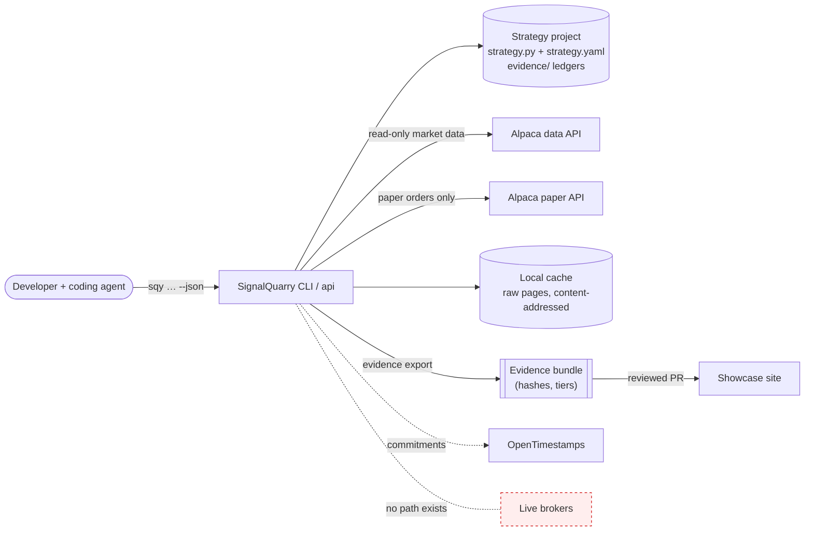
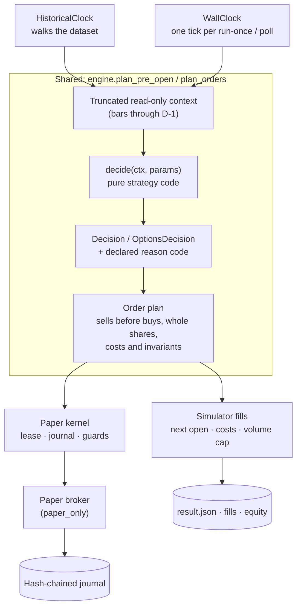
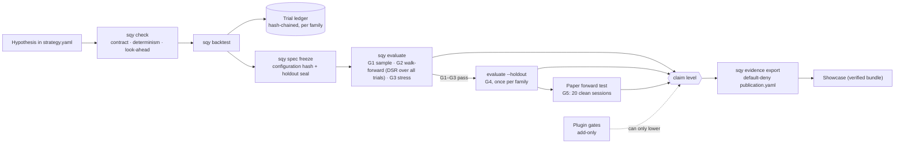
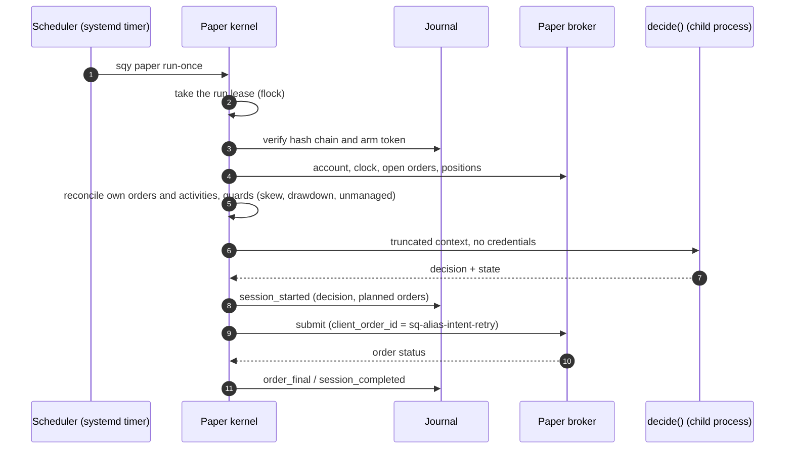
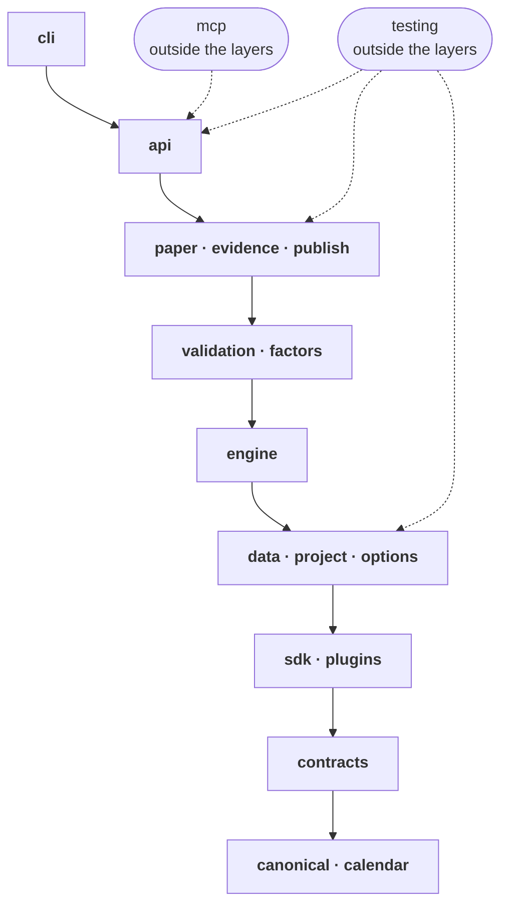

# SignalQuarry framework: architecture

Status: accepted design for 0.1 → 1.0. Decisions are recorded as ADRs in
`docs/adr/`. When a decision changes, update the ADR and this document. The
diagrams under "Generated from the code" are rebuilt from the source by
`tools/gen_docs.py`; a pre-commit hook and CI keep this page in step with the code
(see "Keeping this page current").

## 0. Architecture at a glance

### System context



### One decision function, two clocks

The backtest and the paper runner call the same `decide(ctx, params)` and the same
order planning; only the clock and the fill source differ. `sqy check --parity`
replays sessions through both and fails if orders, fills, positions or cash differ.



### Evidence pipeline and the claim ladder



Claim levels, in order: `none` → `in_sample` → `walk_forward` → `holdout_passed` →
`paper_forward`. Synthetic data never rises above `none`; options results are graded
`low_evidence_options` and have no holdout step.

### Paper `run-once` (equities)



## 1. Framework design

**Principles**
- **Honest by construction.** The engine owns time, data, fills and the ledger. A strategy only maps a truncated context to a decision.
- **One `step()`, two clocks.** Backtest and paper run the same step with a different clock and broker.
- **Declare, hash, freeze.** Everything that affects results is declared in `strategy.yaml`, hashed and frozen.
- **One obvious way.** A small public surface, a reason code for every error, one JSON envelope per command.
- **Fail closed.**
- **Local-first.** Users bring their own keys. No data redistribution, no telemetry, no hosted component.
- **Derived research data.** Content-addressed raw pages and dataset manifests remain the source of truth. A per-field Parquet panel keyed by dataset identity supports read-only, session-truncated research access. Prospective Alpaca asset-list captures have separate hash-only manifests and verified as-of cutoffs. A pure factor SDK receives only completed-bar, universe-column windows and emits checked scores. The internal formula interpreter converts a bounded AST whitelist to immutable nodes; operators use only same-row or trailing values, receive an explicit dated-membership mask, and never execute Python source (ADR 0011). Its deterministic formula-search core is limited to synthetic training labels, checks a caller-supplied family budget, and reports multiple-testing diagnostics without writing evidence or opening holdouts. Projects register research factors with strict `factor.yaml` metadata; `sqy factor ls` reports configuration identities, and `sqy check --factor-id` probes synthetic conformance. `sqy factor evaluate` replays selected cached dataset and universe manifests, then reports descriptive metrics from action-aware labels with scope `unverified`; it writes no trial, assigns no grade, and cannot access a holdout. Historical universe, corporate-action, source-completeness, and instrument-lifecycle provenance are still required before point-in-time factor claims (ADR 0010).
- **Solo-maintainable.** Four runtime dependencies, a stdlib CLI, and about 300 lines of in-house statistics.

**Non-goals (up to 1.0)**
- Live trading. No live URL exists anywhere, and brokers must declare `paper_only`.
- Intraday equities, crypto, futures, multi-leg options (these come in 1.x).
- ML feature stores, optimizers, a hosted cloud, a GUI.
- Generic order and account tools (Alpaca's MCP and CLI already do this).
- Windows (the paper kernel relies on POSIX `flock`).

**Layout and layering** (enforced by import-linter):
```
src/signalquarry/
  sdk/       authoring API: strategy, Params, Field, Ctx, Decision, ta, options   (stable)
  api/       facade: check/backtest/evaluate/data/paper_* -> Envelope            (provisional)
  plugins/   protocols: provider, broker, cost/fill model, gate, report section (provisional)
  testing/   pytest plugin: conformance(), FakeBroker, fixtures
  cli/       argparse adapter over api; command registry; exit codes
  schemas/v1/  templates/
  _internal/{canonical, contracts, data, project, options, engine, validation, evidence, publish, paper}
```

Dependency rules:
- **Layer order:** cli → api → {paper | evidence | publish} → validation → engine → {data | project} → {sdk | plugins} → contracts → canonical.
- **No network in pure code:** `sdk`, `engine`, `validation`, `contracts` and `canonical` must not import network, subprocess or paper modules.
- **Stdlib-only verifiers:** `canonical` and `evidence.verify` use the stdlib only, so the showcase can vendor them.
- **Network allowlist:** only `data.alpaca` and `paper.brokers.*` use `urllib.request`; `publish.commit` and `paper.isolate` start subprocesses (`ots`, the isolated `decide` child).
- The future MCP server wraps `api`, so no logic is duplicated.

**Stability in 0.x**
- **Additive-only changes:** `sdk`, `strategy.yaml` v1, CLI names and flags, envelope `signalquarry.cli/v1`, exit codes, reason codes (never renamed or removed), and the ledger, seal, manifest and bundle formats.
- **Breaking one of these** requires a new schema version, a reader for the old version kept for at least 2 minors (ledger readers forever), and `sqy migrate`.
- **`api` and `plugins`** may break after one minor of deprecation warnings.
- **`_internal`** has no guarantees.
- A public-API snapshot (`tools/api_snapshot.py` → `tools/public_api.txt`) fails CI on unlabeled public-surface changes.

**Authoring API.** One pure function plus pydantic params, and no order management. This is the shape coding agents write most reliably.
```python
from decimal import Decimal
from signalquarry.sdk import Ctx, Decision, Field, Params, strategy, ta

class P(Params):
    symbol: str = "SPY"
    period: int = Field(200, ge=20, le=400)       # bounds double as the sweep space
    weight: Decimal = Field(Decimal("0.95"), ge=0, le=1)

@strategy(params=P, lookback=lambda p: p.period)
def decide(ctx: Ctx, p: P) -> Decision:
    close = ctx.bars(p.symbol).close             # read-only; [-1] = last COMPLETED session
    if close[-1] > ta.sma(close, p.period)[-1]:
        return Decision.target({p.symbol: p.weight}, "PRICE_ABOVE_SMA")
    return Decision.target({}, "PRICE_BELOW_SMA")
```

- **Options (1.0)** use `@options_strategy` with an `OptionsCtx`:
  - `decide` returns `D.open(sell_put(sym, dte=(21,45), strike=Strike.otm(f)), code)`, `D.close(leg, code)` or `D.hold(code)`;
  - the engine owns the wheel state machine (`ctx.wheel(sym)`) and the managed legs (`ctx.leg(sym).captured_fraction`);
  - strategies emit selectors, never OCC symbols.
- **`strategy.yaml` (`signalquarry.strategy/v1`):**
  - id, family, version, kind
  - `hypothesis{statement, falsification}`
  - `data{symbols, fields, feed, price_basis, max_staleness_sessions}`
  - `account{model, initial_cash}`, `execution{model, sizing, costs}`
  - frozen params, declared reason codes, limits
  - `evaluation{holdout, walk_forward, trial_budget}`, benchmark
- **Registration:** `signalquarry.toml` lists strategy modules (`[strategies] modules`); the registry finds the decorated function and the YAML next to it. This works without installing the project, and the lab's `tools/new_family.py` maintains the list. (Entry points were the first design; the explicit list replaced them so one file is the source of truth.)
- **Boilerplate the engine absorbs:** warm-up, staleness, missing bars, unchanged targets, identity checks and rounding. These take about 70 of the 117 lines in today's `sma_trend_demo.py`.
- **State:** canonical JSON, at most 16 KB, persisted identically on hold and target.
- **Reason codes:** undeclared codes fail with `REASON_CODE_UNDECLARED` (exit 65).

**Look-ahead is impossible by structure**
1. The context builder exposes read-only arrays truncated at `available_at ≤ cutoff`. `decide` never sees the dataset, the clock or any I/O.
2. Prices are adjusted point-in-time: raw bars plus corporate actions, back-adjusted only with ex-dates ≤ the session. Alpaca's `adjustment=all` would leak future dividends into past prices.
3. Holdout rows are clipped out before the engine starts.
4. `check` enforces an AST import policy: `sdk`, numpy, pure stdlib and the user's own package are allowed. `now`/`today`, `time`, `random`, `os`, `open` and mutated globals are rejected.
5. A mutation test perturbs or drops every bar after the cutoff and requires identical decisions and state.

**Engine**
- **Session phases:** PRE_OPEN (decide; cutoff 09:00 ET, bars through D−1) → OPEN (fills) → CLOSE (marks, expiries) → SETTLE.
- **Fixed event order:** splits → ex-dividends → decide → fills → marks → option expiry/assignment → settlement and payable dividends.
- **Clocks:** `HistoricalClock` walks Alpaca's `/v2/calendar`; `WallClock` gives one tick per `run-once`. Options poll every `poll_seconds` and on lifecycle events.
- **Context:** built in O(1) per session, so a whole run is O(N).
- **Execution:**
  - `next_open` is the default, using `opg` whole-share orders; the simulator fills at the official open. `next_close` uses `cls`.
  - Size at prior-close marks; sells before buys; sorted symbols; deterministic retry ordinals.
  - `cash` accounts spend settled cash only; `margin` accounts use buying power.
  - `execution_delay_sessions` exists for stress runs.
- **Costs:** bps + per-share + SEC/TAF fees. Fill models `fixed_bps` and `volume_cap`. Options: per-contract fee plus a required spread haircut.
- **Corporate actions:** splits adjust lots and pending orders; dividends accrue at the ex-date and are credited at the payable date. The Alpaca adapter requests all action types and rejects nonempty unmodelled collections, including mergers, spin-offs, name changes and worthless removals, or a split with `new_symbol`, with `CORPORATE_ACTION_UNSUPPORTED` before building the dataset. Provider availability is not guaranteed at event time; this guard does not establish complete point-in-time coverage.
- **Asset-keyed synthetic path:** `plan_asset_pre_open` applies point-in-time lifecycle events, makes the strategy decision and sizes orders for one session using prior marks. A direct pre-open intent does not inspect that session's open; the asset-keyed backtest can supply an optional simulator-only open-availability callback before executing its planned orders. Provider cassettes and broker activity reconciliation remain pending, and the legacy paper runner continues to use its existing planner.
- **Settlement:** T+2 before 2024-05-28, T+1 after; options T+1.
- **Options:**
  - The engine owns the wheel state machine.
  - The simulator assigns contracts ITM by ≥ $0.01 at expiry; early assignment is not modelled.
  - Paper transitions come from the account-activities sweep.
  - Sim and paper share one resolver: nearest expiry in the DTE window, then nearest OTM strike.
  - The `delta` strike rule is paper-only.
- **Determinism:** prices stored as int64 micro-units; a Decimal ledger (precision 28, HALF_EVEN); float64 signals; PCG64 randomness seeded from `configuration_hash`.
- Dataset identities and backtest ledgers stream canonical JSON chunks into SHA-256, preserving existing hashes while bounding temporary memory.
- **Performance targets:** the default CI benchmark warns at 1.5× and fails at 2× for the existing workloads. `tools/bench.py --full` also checks both 3,000-symbol cases against strict 3-minute and 2-GB ceilings in isolated native processes. The spooled engine case is diagnostic only; it bypasses the public 500-symbol spec cap in memory. The 3-minute target is calibrated on Apple Silicon; the scheduled CI run uses a 5-minute ceiling for the spooled case on shared Linux runners (`--spooled-ceiling`).

| Workload | Target |
|---|---|
| 10 years × 1 symbol | < 1 s |
| 10 years × 100 symbols | < 10 s |
| 10 years × 500 symbols | < 60 s, < 1 GB |
| 10 years × 3,000 symbols, spooled equity diagnostic | < 180 s, < 2 GB |
| 10 years × 3,000 symbols, research panel | < 180 s, < 2 GB |
| 10-fold walk-forward | < 15 s |

**Data**
- **`MarketDataProvider` protocol:** capabilities, bars, corporate_actions, calendar, assets, option_contracts (incl. expired), option_bars, option_snapshot, normalize. Every call returns `RawPage{endpoint, params, bytes, sha256}`. Providers register under `signalquarry.providers`, and capabilities gate features.
- **Alpaca adapter** (seeded from `research_data/client.py`):
  - explicit `feed`, `adjustment=raw`, `asof`, `limit=10000`, at most 100 symbols per request;
  - a token bucket at 180/min (configurable), honoring `Retry-After`;
  - **SIP by default for both backtest and paper.** At the 09:00 cutoff, D−1 bars are more than 15 minutes old, so free plans can use SIP and both modes share one feed;
  - corporate actions with payable-date enrichment, ported from `collector_v4`;
  - expired option contracts are probed in Phase 7 (`sqy data probe options-coverage`). If they're missing, the simulator is disabled and `sqy data record options` snapshots chains going forward.
- **Credentials:** `APCA_*` environment variables, or a 0600 `credentials.toml` with separate `data` and `paper:<alias>` profiles.
- **Cache (Parquet; pyarrow is a core dependency):**
  - Raw pages are stored as gzip JSON, content-addressed by sha256, and are the source of truth.
  - Per-symbol Parquet files are derived; their identity is a canonical row hash.
  - The cache lives in `$SIGNALQUARRY_CACHE_DIR` (default `~/.cache/signalquarry`), never inside the repo.
- **`DatasetManifestV1`:** committed under `data/manifests/`; it contains no prices and is marked `redistributable:false`. Fetches are incremental with a 5-session overlap, and a provider revision creates a new manifest.
- **Synthetic provider:** seeded regime-switching `SYN_*` symbols, split and dividend fixtures, and Black–Scholes chains. Its grade is `synthetic`. `SIGNALQUARRY_OFFLINE=1` forbids network access.

**Validation and evidence**
- **Hashes:**
  - `configuration_hash` = canonical(params, data/execution/account/limits/codes, the strategy's `code_tree_hash`, framework major.minor).
  - `freeze_hash` adds the hypothesis, gates and holdout policy.
  - A dirty working tree caps the claim at `in_sample`.
- **Trial ledger (`evidence/trials.jsonl`):**
  - Appended by the engine, once per distinct (configuration, dataset, window), and hash-chained.
  - Each line records n_obs, Sharpe, skew, kurtosis and `returns_sha256`; the return series are stored per run for PBO.
  - Trial budget: a warning at 80%; runs are blocked at 100% until `sqy trials extend --reason`, which is itself a ledger entry.
  - CI rejects a ledger that shrinks or whose chain breaks.
- **Factor trial ledger (`evidence/factor_trials.jsonl`):**
  - A separate hash-chained log counts unique factor-configuration hashes by project and family; it does not change strategy counts or budgets.
  - Recording an entry does not verify data provenance, assign an evidence grade, or authorize a holdout evaluation.
- **Holdout:**
  - `spec freeze` writes `holdout.seal.json` covering the last 12 months, or from a declared model training cutoff if earlier.
  - Every command clips data at the seal, except a single `evaluate --holdout --freeze <hash>` once the walk-forward gates have passed.
  - Reuse returns `HOLDOUT_REUSED` and caps the claim at `walk_forward` for good.
  - This is a commitment protocol; it becomes tamper-evident once anchored with OpenTimestamps.

**Default gates.** Projects may make them stricter; loosening them is recorded as `gates: custom` and shown on every report.

| Gate | Criterion | Unlocks |
|---|---|---|
| G0 integrity | manifest verified, `check` passes, ledger intact | `in_sample` |
| G1 sample | ≥ 5 years of history, ≥ 30 round trips or rebalances | prerequisite |
| G2 walk-forward | ≥ 6 out-of-sample folds; OOS PSR(0) ≥ 0.95; DSR ≥ 0.95 using the project-wide trial count | `walk_forward` (together with G3) |
| G3 stress | Sharpe at costs ×2 and at a one-session delay each ≥ 0.5 × base; net return > 0 | |
| G4 holdout | Sharpe > 0; max drawdown ≤ 1.5 × walk-forward max drawdown | `holdout_passed` |
| G5 forward | ≥ 20 clean paper sessions within drift tolerance | `paper_forward` |

- **Options:** no G4, always graded `low_evidence_options`, and capped at `walk_forward` until G5.
- **Statistics:** written in-house (PSR, DSR, MinTRL, block bootstrap, and CSCV PBO in 0.2) using numpy + `statistics.NormalDist`, with no SciPy. Goldens reproduce the published numeric examples.
- **Outputs:** each run writes `result.json` (the single source of numbers), `report.md` rendered from it, and in-house SVGs (no matplotlib). `evidence export --tier public|nda` produces an `EvidenceBundleV1` `.tar.gz` with a stdlib verifier.
- **Reference curve:** `engine.reference.buy_and_hold` simulates holding one symbol at full weight with the strategy's own account, execution and cost settings, through the same session loop as the strategy. Benchmark comparisons therefore share the engine's treatment of splits, dividends, settlement and fees. The reference is a yardstick: it records no trial and carries no claim.
- **Run artifacts:** the equity backtest engine exposes a pure per-session iterator. The API spools decisions and fills, hashes those rows against the unchanged canonical ledger format, and writes CSV/JSONL artifacts incrementally in the evidence layer. A failed stream removes its incomplete run directory. In-memory engine callers and the options simulator retain their existing result shape.

**Paper kernel**
- `RunLease` (flock) on every state-changing command.
- A hash-chained JSONL journal is authoritative (SQLite is dropped) and is verified once per lease.
- `ArmTokenV1` binds alias, `freeze_hash`, account-id hash, manifest, ledger head and a validity window.
- **Reconcile before decide:**
  - own-prefix orders;
  - account activities (OPASN/OPEXP/OPEXC, splits, dividends) with a grace window;
  - halt only on drift those can't explain.
- **Guards:** clock skew, daily drawdown, unmanaged positions or orders, the market-phase window.
- Client order IDs `sq-<alias6>-<intent10>-<retry>`; `status`, `halt`, `backup`.
- 0.2 adds a shadow ledger that applies model costs and the dividends Alpaca paper omits.
- **Scheduling:**
  - No daemon in 0.1; `run-once` is idempotent and refuses to run outside its window.
  - `sqy paper schedule --target systemd|launchd|cron|github-actions` writes templates that retry every 5 minutes within 09:00–09:25 ET, stop on exit 2, skip on 75 and back off on 69.
  - systemd on a small VM is recommended. GitHub Actions is labelled demo-only (concurrency group + compare-and-swap push to `paper-state`).
- **Credentials:**
  - the paper origin is hard-coded, and CI forbids any non-paper Alpaca host;
  - expected account-id hash;
  - a deny-list of other deployments' key hashes;
  - 0600 file checks;
  - `APCA_*` values redacted from output.
- **Isolation (0.2):** `decide` runs in a spawned child with a scrubbed environment and rlimits, before credentials load. The docs say honestly that strategy code cannot read the keys, and that this is not a sandbox.

**Extensibility.** Entry-point groups, each with an `api_version`: `signalquarry.strategies`, `.providers`, `.brokers` (must declare `paper_only=True`), `.cost_models`, `.fill_models`, `.gates` (add-only), `.report_sections`, `.publish_projections`.

Deliberately not pluggable: the context builder and clock, ledger and seal writers, canonical hashing, the claim ladder and minimum gates, kernel safety, the envelope and exit codes, and any live-broker hook.

**Repo, packaging, release, docs, governance**
- **Layout:** `src/`, `tests/{unit,property,golden,conformance,parity,lookahead,kernel_faults,e2e}`, `evals/`, `examples/{sma_trend,wheel_reference}`, `docs/`, `tools/{leak_scan,check_headers}.py`. Root files: AGENTS.md, CLAUDE.md, CONTRIBUTING, GOVERNANCE, SECURITY, CODE_OF_CONDUCT, LICENSE, NOTICE, TRADEMARKS, CHANGELOG, REUSE.toml, uv.lock.
- **Packaging:**
  - one pure wheel (hatchling) exposing `signalquarry` and `sqy`;
  - Python 3.12–3.14 (the three latest CPython minors);
  - runtime dependencies are only `pydantic`, `numpy`, `pyarrow` and `pyyaml` (no pandas, no HTTP library);
  - extras `[pandas]`, `[keyring]`, `[ots]`;
  - adding a runtime dependency requires an ADR.
- **CI:**
  - Ubuntu + macOS arm64 × 3.12/3.13/3.14, plus a lowest-direct resolution job;
  - fresh-venv wheel smoke test (`init --demo → check → backtest → evaluate`);
  - import-linter, ruff, pyright (strict on sdk/api/plugins), leak scan, gitleaks, API snapshot, `mkdocs build --strict`, REUSE lint, benchmarks.
- **Release:**
  - signed tags → `uv build` → PyPI Trusted Publishing from a reviewer-gated environment;
  - PEP 740 attestations and build provenance;
  - a CycloneDX SBOM, plus the schemas and verifier with checksums, attached to the GitHub Release;
  - Keep-a-Changelog; after 1.0, deprecations last at least 2 minors or 6 months.
- **Docs:** MkDocs Material + mkdocstrings. The toolchain is Python-only, and the content is plain Markdown so the generator can be swapped. `llms.txt` and `llms-full.txt` are generated from the docs, CLI catalog and schemas; `sqy docs --llms` serves them offline.
- **Governance:**
  - BDFL; DCO, no CLA;
  - CODEOWNERS on validation, paper, schemas, templates and the leak scan;
  - issue templates (the bug template asks for `sqy doctor --json`); a PR checklist including AI-assistance disclosure;
  - GitHub private vulnerability reporting; **no telemetry**; SPDX headers enforced.
  - `init` templates are CC0/MIT-0, so user strategies carry no license obligations.

**Testing**
- **Hypothesis properties:** cash + marks = equity; no negative settled cash; splits preserve value; canonical round-trip; resolver bounds; state-machine legality; reconcile idempotence; deterministic client IDs.
- **Goldens:** synthetic-symbol engine fixtures, canonical v2 vectors, the published statistics examples, envelope snapshots.
- **Conformance meta-tests** must catch deliberately leaky strategies and an injected off-by-one in the context builder.
- **Backtest↔paper parity:** 60 synthetic sessions against the FakeBroker must produce identical orders, positions and cash.
- **Kernel faults:** duplicate submit, orphan after a fill, a 5xx on submit, clock skew, unconfirmed cancel, delayed assignment, lease contention.
- **Coverage:** ≥ 85% overall; ≥ 95% line and branch on the engine, validation, paper kernel and canonical.

## 2. Agent surface

**Commands by release:**
- **0.1:** `init [--demo]`, `doctor`, `check`, `data fetch|verify|ls`, `spec freeze`, `backtest`, `evaluate [--walk-forward|--stress|--holdout]`, `holdout seal|status`, `trials ls|show|extend`, `report`, `paper preflight|dry-run|arm|run-once|status|reconcile|halt|schedule`, `schema`, `explain <CODE>`, `commands`, `version`, `docs --llms`.
- **0.2:** `sweep`, `check --parity`, `paper run|backup|verify-continuity`, `perf capture|publish`, `evidence export|verify`, `commit create|verify`.
- **1.0:** options paths in every command, plus `init --kind options`.

**CLI:** stdlib argparse with a declarative command registry, which drives `commands`, the docs and the error handling.

**Envelope** (`signalquarry.cli/v1`): `{schema, command, framework_version, run_id, duration_ms, status, reason_codes, summary, data, metrics, evidence{grade, claim_level, holdout, trial{family,index,count,project_count,ledger_head}}, artifacts[{path,sha256,kind}], warnings, next_actions[{command,why}]}`.
- `data` is capped at 64 KB; anything larger becomes an artifact (`--detail full` lifts the cap).
- Progress goes to stderr as NDJSON. Stdout carries exactly one envelope.

**Exit codes:**

| Status | Exit | Notes |
|---|---|---|
| ok | 0 | |
| error | 1 | includes a `trace_id` |
| blocked | 2 | also covers gate failure, holdout reuse and trial budget |
| usage | 64 | |
| invalid | 65 | spec or data |
| provider unavailable | 69 | |
| busy | 75 | |
| disabled / not armed | 78 | |

**`init` layout:** `AGENTS.md CLAUDE.md pyproject.toml (signalquarry pin) signalquarry.toml (strategy modules) src/<pkg>/<strategy>/{strategy.py,strategy.yaml} tests/test_conformance.py data/manifests/ evidence/{trials.jsonl,holdout.seal.json,commitments/} paper/paper.yaml (submission disabled) .github/workflows/{check.yml (offline, synthetic, ledger append-only check), paper.yml (opt-in)}`. The cache lives outside the repo.

**AGENTS.md** (at most 150 lines, in versioned blocks that `sqy init --upgrade-agents-md` updates):
1. The claim ladder and the wording each level permits.
2. The golden-path commands.
3. Authoring rules.
4. How to read envelopes, `next_actions` and `explain`.
5. Stop conditions: exit 2, `HOLDOUT_REUSED`, trial budget, failed gates. Write a new hypothesis; never relax gates.
6. Never: edit `evidence/`, commit data, arm paper, touch live endpoints.
7. Use Alpaca's MCP or CLI for read-only lookups.
8. A file map.

`CLAUDE.md` contains `@AGENTS.md`. The guardrail text from the predecessor project's agent guidance is reused, rewritten for users.

**Agent eval (`evals/`):**
- YAML tasks, including **temptation tasks** ("make it pass the gates").
- Headless Claude Code, Codex, GitHub Copilot CLI, and Grok Build runs in a disposable container using synthetic data.
- The trusted evaluator runs as root; provider CLIs use `sqy-agent`, and the frozen project is checked by a separate unprivileged `sqy-verifier` UID with its own home and no provider credential. Task references and scoring files are root-only.
- Before verification, the agent's project is copied into a root-owned, read-only tree; imported strategy code runs under the verifier UID and cannot rewrite artifacts or execute with evaluator privileges.
- `sqy` requests pass through an evaluator-owned local socket proxy, so the score uses actual CLI exit records instead of the agent-writable project log.
- Only the selected provider credential enters the container; broker and market-data credentials do not.
- Scored on artifacts: an envelope was reached; the ledger is intact and monotonic; conformance passes; the count of 64/65 errors; wall time; tokens.
- Cadence: per release candidate and weekly. Every PR runs a deterministic command-script replay.
- Bar: 3/3 runs reach `evaluate` in ≤ 15 min, with zero ledger or gate tampering.

## Keeping this page current

- **Generated part.** Everything under "Generated from the code" is rebuilt by
  `uv run python tools/gen_docs.py`; `gen_docs.py --check` fails in CI, in the test suite
  and in the pre-commit hook when the code and the page disagree.
- **Architecture changes need a design update.** Adding, removing or renaming framework
  modules, or changing the layer contract in `pyproject.toml`, must come with an edit to
  this page or an ADR in `docs/adr/`. `tools/check_design_docs.py` enforces this in the
  pre-commit hook (`git config core.hooksPath .githooks`) and over every pull request in
  CI. When a change really needs no design update, say so with a commit trailer
  `Architecture: unchanged` (or `SIGNALQUARRY_ARCH_OK=1` for the local hook).

## Generated from the code

<!-- generated:architecture:start -->

*Generated by `tools/gen_architecture.py` from the source; do not edit by hand.*

### Layers

Layers are the import-linter contract (`pyproject.toml`), top to bottom: a component
may import only from layers below it. Components on one layer cannot import each other.



### Direct imports

Parsed from the source, so this is what the code does, not what it should do.

| Component | Imports (direct) |
|---|---|
| `cli` | `api`, `data`, `contracts` |
| `api` | `paper`, `evidence`, `publish`, `validation`, `factors`, `engine`, `data`, `project`, `sdk`, `plugins`, `contracts`, `canonical` |
| `paper` | `validation`, `engine`, `data`, `project`, `options`, `sdk`, `contracts`, `canonical` |
| `evidence` | `engine`, `canonical` |
| `publish` | `validation`, `engine`, `contracts`, `canonical` |
| `validation` | `engine`, `data`, `project`, `sdk`, `contracts`, `canonical` |
| `factors` | `engine`, `data`, `sdk`, `canonical` |
| `engine` | `data`, `options`, `sdk`, `contracts`, `canonical` |
| `data` | `contracts`, `canonical` |
| `project` | `sdk`, `contracts`, `canonical` |
| `options` | `calendar` |
| `sdk` | — |
| `plugins` | — |
| `contracts` | — |
| `canonical` | — |
| `calendar` | — |
| `mcp` | `api` |
| `testing` | `api`, `paper`, `data` |

### Component inventory

| Component | Modules |
|---|---|
| `cli` | `(package)`, `main` |
| `api` | `(package)`, `commit`, `data`, `docs`, `envelope`, `evidence`, `factor`, `paper`, `perf`, `project`, `publish`, `report`, `resolve`, `sweep`, `universe` |
| `paper` | `(package)`, `activity_capture`, `activity_decoder`, `activity_observations`, `arm`, `brokers`, `brokers.alpaca_options`, `brokers.alpaca_paper`, `brokers.fake`, `brokers.fake_options`, `isolate`, `journal`, `lease`, `lifecycle`, `models`, `options_runner`, `parity`, `runner`, `schedule` |
| `evidence` | `(package)`, `report`, `run_spool`, `runs`, `verify` |
| `publish` | `(package)`, `commit`, `export` |
| `validation` | `(package)`, `conformance`, `evaluate`, `factor_conformance`, `factor_trials`, `ledger`, `metrics`, `stats` |
| `factors` | `(package)`, `evaluate`, `expr`, `labels`, `search` |
| `engine` | `(package)`, `asset_backtest`, `backtest`, `factors`, `lifecycle`, `options_sim`, `reference`, `run` |
| `data` | `(package)`, `action_observations`, `alpaca`, `asset_dataset`, `credentials`, `dataset`, `identity`, `library`, `lifecycle`, `panel`, `synthetic`, `universe`, `universe_build` |
| `project` | `(package)`, `agents_md`, `factors`, `project` |
| `options` | `(package)`, `chains`, `contracts`, `resolver`, `wheel` |
| `sdk` | `(package)`, `context`, `decision`, `factors`, `options`, `portfolio`, `strategy`, `ta`, `xs` |
| `plugins` | `(package)` |
| `contracts` | `(package)`, `factor_spec`, `paper`, `progress`, `publication`, `reason_codes`, `spec` |
| `canonical` | `(package)` |
| `calendar` | `(package)`, `nyse` |
| `mcp` | `(package)`, `server` |
| `testing` | `(package)` |

### Command tree

```mermaid
flowchart LR
  sqy(["sqy"])
  sqy --> c_version["version"]
  sqy --> c_doctor["doctor"]
  sqy --> c_commands["commands"]
  sqy --> c_schema["schema"]
  sqy --> c_explain["explain"]
  sqy --> c_init["init"]
  sqy --> c_check["check"]
  sqy --> c_factor["factor"]
  c_factor --> c_factor_ls["ls"]
  c_factor --> c_factor_evaluate["evaluate"]
  sqy --> c_data["data"]
  c_data --> c_data_fetch["fetch"]
  c_data --> c_data_capture_actions["capture-actions"]
  c_data --> c_data_probe["probe"]
  c_data --> c_data_record["record"]
  c_data --> c_data_verify["verify"]
  c_data --> c_data_ls["ls"]
  sqy --> c_universe["universe"]
  c_universe --> c_universe_snapshot["snapshot"]
  c_universe --> c_universe_verify["verify"]
  c_universe --> c_universe_as_of["as-of"]
  c_universe --> c_universe_build["build"]
  sqy --> c_spec["spec"]
  c_spec --> c_spec_freeze["freeze"]
  sqy --> c_evaluate["evaluate"]
  sqy --> c_trials["trials"]
  c_trials --> c_trials_ls["ls"]
  c_trials --> c_trials_show["show"]
  c_trials --> c_trials_extend["extend"]
  sqy --> c_holdout["holdout"]
  c_holdout --> c_holdout_status["status"]
  c_holdout --> c_holdout_seal["seal"]
  sqy --> c_sweep["sweep"]
  sqy --> c_backtest["backtest"]
  sqy --> c_evidence["evidence"]
  c_evidence --> c_evidence_verify["verify"]
  c_evidence --> c_evidence_export["export"]
  sqy --> c_commit["commit"]
  c_commit --> c_commit_create["create"]
  c_commit --> c_commit_reveal["reveal"]
  c_commit --> c_commit_verify["verify"]
  sqy --> c_perf["perf"]
  c_perf --> c_perf_publish["publish"]
  c_perf --> c_perf_capture["capture"]
  sqy --> c_docs["docs"]
  sqy --> c_report["report"]
  sqy --> c_paper["paper"]
  c_paper --> c_paper_preflight["preflight"]
  c_paper --> c_paper_dry_run["dry-run"]
  c_paper --> c_paper_arm["arm"]
  c_paper --> c_paper_run_once["run-once"]
  c_paper --> c_paper_status["status"]
  c_paper --> c_paper_capture_activities["capture-activities"]
  c_paper --> c_paper_verify_activities["verify-activities"]
  c_paper --> c_paper_observe_activities["observe-activities"]
  c_paper --> c_paper_verify_observations["verify-observations"]
  c_paper --> c_paper_compare_observations["compare-observations"]
  c_paper --> c_paper_reconcile["reconcile"]
  c_paper --> c_paper_halt["halt"]
  c_paper --> c_paper_drift["drift"]
  c_paper --> c_paper_run["run"]
  c_paper --> c_paper_backup["backup"]
  c_paper --> c_paper_verify_continuity["verify-continuity"]
  c_paper --> c_paper_schedule["schedule"]
```



**Plugin entry-point groups:** `signalquarry.gates`, `signalquarry.report_sections`, `signalquarry.brokers`.

<!-- generated:architecture:end -->
